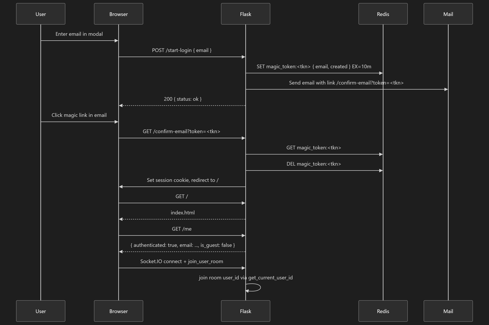

# Simplified Crypto App (V2)

## Prerequisites
- Python 3.7 or higher  
- Redis server running on `localhost:6379`  

## Installation
1. Navigate to the `V2` directory:
   ```
   cd V2
   ```
2. Create a virtual environment (optional but recommended):
   ```
   python -m venv venv
   venv\Scripts\activate    # Windows
   source venv/bin/activate # macOS/Linux
   ```
3. Install dependencies:
   ```
   pip install -r requirements.txt
   ```

## Configuration
- Redis is used to store user settings under the key `settings`.  
- No additional configuration is required for development; defaults are used.

## Running the App
1. Ensure Redis server is running.
2. Launch the Flask app:
   ```
   python app.py
   ```
3. Open your browser and navigate to:
   ```
   http://127.0.0.1:5000/
   ```

## Usage
1. **Email Confirmation**
   Click or copy the confirmation link to `/confirm-email?email=you@example.com&token=...` to establish a session with your email.
2. **Settings**  
   - Use the form on the homepage to enter a `symbol` (e.g., BTCUSDT) and an `interval` (e.g., 5).  
   - Click **Save Settings** to POST to `/settings`.  
   - Click **Load Settings** to GET saved settings from the server.
3. **Data**
   - Click **Get Data** to GET `/data`, which returns dummy crypto data.

### Authentication Process

The authentication process is illustrated in the following diagram:



Users must confirm their email by clicking the confirmation link sent to their email address. This establishes a session with your email, enabling access to the application's features.

## Notes
- Authentication is cookie-based using `user_email` (stored in Flask sessions).
- This is a simplified version for demonstration purposes.